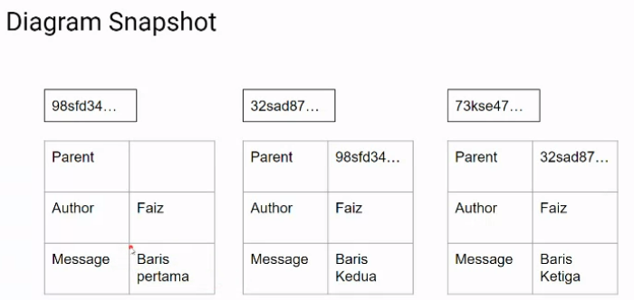
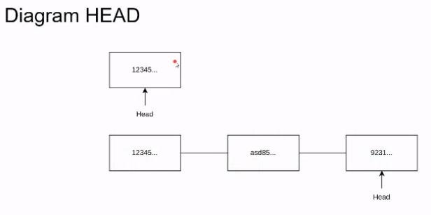

terdapat 3 state dan section di git

.) modified -> working directory
.) staged -> staging area
.) committed -> repository

snapshot -> menghasilkan hash sebagai identitas untuk setiap commitnya

jika antar snapshot tidak sesuai maka susunan parentnya akan rusak

perhitungan hash

.) tidak hanya pada perubahan file tapi juga dari parent, dan child

head

.) pointer untuk menunjuk hash paling akhir

praktik

**Menambah File**
//git add .
atau
// git add file.ext

setelah di add akan pindah ke state staged -> staging area

**Commit file**
setelah melakukan add kita lakukan commit agar state pindah ke committed

//git commit -m 'pesan commit'

setelah di commit git akan memberikan sha yang unik
dan kondisi statenya berubah ke committed -> repository

**Melakukan log**

kita bisa lakukan log untuk melihat perubahan yang kita lakukan

//git log

Conventional Commit Message
agar setiap push yang kita lakukan terlihat jelas pesannya
kita bisa lakukan conventional commit message setelah file di add

-> Feat
-> Fix
-> Chore

//git commit -m 'Feat: message'

//git commit -m 'Fix: message'

//git commit -m 'Chore: message'

reference:

https://danielkummer.github.io/git-flow-cheatsheet/
https://www.atlassian.com/git/tutorials/comparing-workflows/gitflow-workflow#:~:text=Gitflow%20is%20an%20alternative%20Git,lived%20branches%20and%20larger%20commits
https://gist.github.com/qoomon/5dfcdf8eec66a051ecd85625518cfd13
https://www.conventionalcommits.org/en/v1.0.0/
