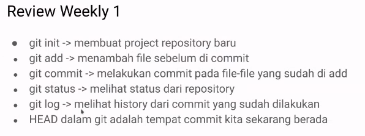

**Review Weekly1**

**Deleting File**
Saat mendelete file maka working directory akan membaca perubahan tersebut
agar perubahan pada github kita terupadate kita perlu lakukan add agar
delete file berpindah ke staged area
jadi langkahnya:
1.) Hapus File
2.) git status
3.) git add (file yang dihapus)
4.) lalu lakukan git log untuk mengecek perubahan yang terjadi
atau
4.) git log --oneline untuk mengecek perubahan secara ringkas
