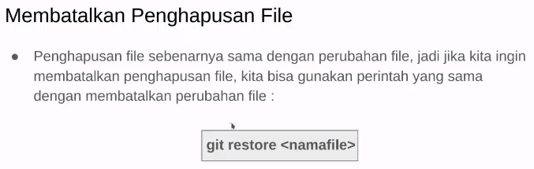
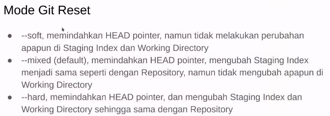
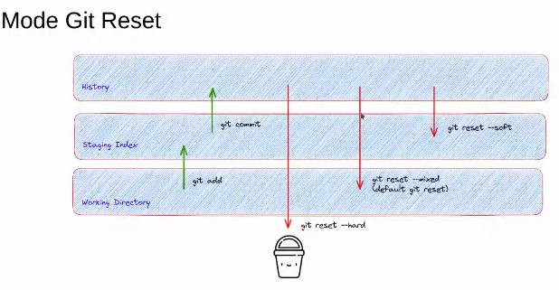
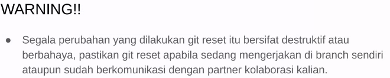

**Review Weekly1**

**Deleting File**
Saat mendelete file maka working directory akan membaca perubahan tersebut
agar perubahan pada github kita terupadate kita perlu lakukan add agar
delete file berpindah ke staged area
jadi langkahnya:
1.) Hapus File
2.) git status
3.) git add (file-yang-dihapus)
4.) git commit -m 'pesannya'
5.) git push origin master
6.) lalu lakukan git log untuk mengecek perubahan yang terjadi
atau
6.) git log --oneline untuk mengecek perubahan secara ringkas

**Membatalkan penambahan file di working directory**
Jika ingin menambahkan file ke working directory dan membatalkan perubahannya

**Membatalkan penambahan file di staged area**
jika ingin membatalkan perubahan pada saat di staged area maka dapat lakukan
/git restore --staged #ini akan membatalkan seluruh perubahan pada staged area
atau
/git restore --staged (nama-file)
maka perubahan dari staged area akan kembali ke working directory

Jika kita ingin membatalkan spesifik file di staged area bisa lakukan

**menghapus file dengan git reset**
terdapat 3 mode pada git reset
--soft hanya memindahkan HEAD pointer
--mixed memindahkan HEAD pointer dan mengubah staging area sama seperti pada repo
--hard memindahkan HEAD pointer dan mengubah staging area, working directory sama seperti pada repo

#Warning pada penggunaan git reset

**Git Revert**
mengembalikan ke kondisi sebelumnya dan membuat commit baru dengan hasil kondisi yang dikembalikan
git revert
