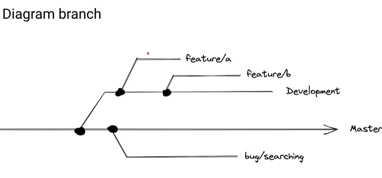
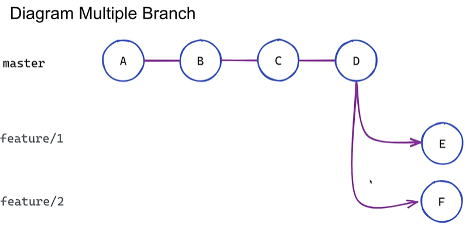
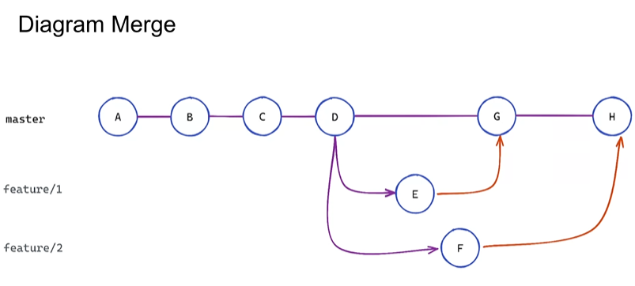

**Amend Commit**
-> mengubah commit terbaru sehingga tidak perlu membuat commit baru
-> dapat dilakukan saat belum melakukan push
-> dapat menambahkan perubahan terabur dan mengubah pesan commit
-> tidak mengubah isi, tetapi hash kita akan berubah

git commit --amend

**.gitignore**
-> ignore file, folder
-> konfigurasi untuk file yang ingin diabaikan, agar tidak ditaruh ke repositori kita

CONTOH:
.) ignore file
.env
.) ignore node_modeules
node_modules/
.) ignore spesifik txt
.txt

**Branching**
-> timeline perubahan yang kita buat
-> saat melakukan branching, kita membuat timeline yang berbeda dengan yang utama (main/ master)
-> setiap branch memiliki timeline yang berbeda, sehingga tidak merusak timeline branch lain

Kapan digunakan?
-> Ketika kita ingin menambahkan fitur baru, tanpa mengganggu fitur utama (main/ master)
-> Fitur baru akan ditambah di branch baru
-> Ketika fitur sudah siap baru kita lakukan merging (penggabungan) ke branch utama (main/master)

Contoh Diagram branch

Memahami branch
-> saat melakukan init, branch utama kita adalah master/main
-> cek branch kita saat ini
git brach --show-current

melihat banyak branch kita
git branch --list
ATAU
git branch
untuk mengetahui posisi branch kita, perhatikan tanda \* nya

-> Cara membuat branch baru
git branch/branch-baru

-> pindah ke branch
git switch branch-baru
ATAU
git checkout branch-baru
ATAU jika ingin pindah langsung ke branch baru
git checkout -b branch-baru

Mengubah nama branch
-> syarat : posisi kita harus di branch tersebut
git branch -m nama-baru

Menghapus branch
-> jika suatu saat branch sudah tidak dibutuhkan
-> Syarat : Posisi kita tidak boleh didalam branch tersebut
git branch -d -nama-branch
git branch --delete nama-branch

**Multiple Branch**
-> Membuat banyak branch dengan multiple branch

Caranya:
1.) pindah ke branch fitur yang ingin dijadikan awal (misal fitur1)
2.) pindah ke branch selanjutnya yang kita ingin lakukan (misal fitur2)
3.) lalu pindah lagi ke branch selanjutnya yang diinginkan (misal fitur 3)

maka setiap perubahan yang terjadi pada tiap branch isi reponya akan berbeda2
karena masing2 berbeda timeline

**Merge**
-> menggabungkan branch
-> Saat melakukan merge, branch fitur-baru tidak akan dihapus, sehingga tetap bisa melakukan
pembaruan fitur pada branch tersebut

Caranya:
1.) Pindah ke branch yang ingin kita masukkan (misal ingin merge main dengan fitur 1, maka kita pindah ke main)
git checkout nama-branch-tujuan
2.) setelah pindah kita lakukan merge
git merge nama-branch-yang-dipilih
NOTE : saat pertama kali dilakukan merge maka ada msg 'FAST-FORWARD' artinya merge dilakukan tanpa ada penghalang
3.) lalu kita lihat jalur branch kita
git log --online-graph

Merge Conflict
-> ketika terjadi merging bersamaan atau bentrok saat di merge, maka akan terjadi conflict
-> setiap perubahan yang tidak conflict akan masuk ke staging area
-> Jika conflict akan masuk ke Working-directory

conflict ini bisa solve jika :
1.) cek apa yang beda
git diff

2.) jika yang dituliskan tidak berkesinabungan (berbeda)
maka kita bisa menambahkan keduanya

membatalkan conflict
git merge --abort
